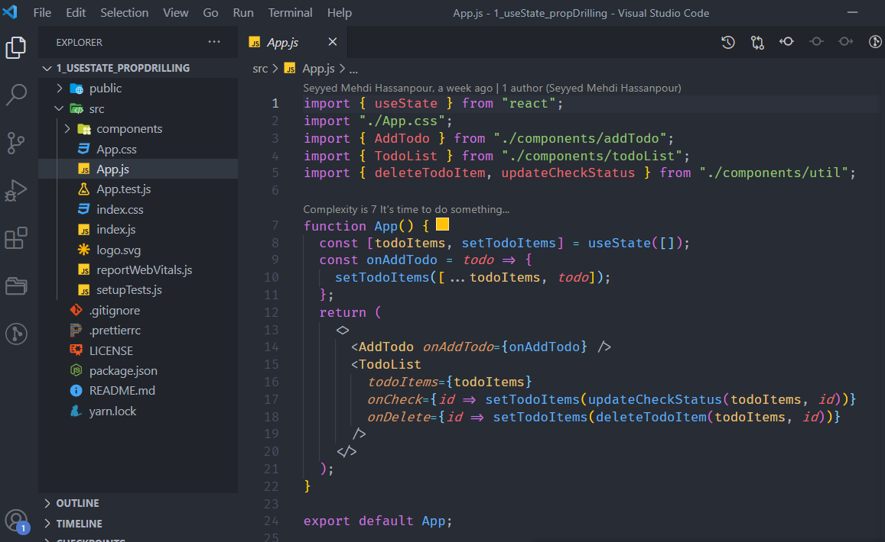

# VSCode Pro - Frontend Developers (ZPack)

#### Web Developer Experience Pack (ZPack series)

An Opinionated collection/pack of extensions for Web Developers in VSCode (With Better `DX` and `load time` in Mind)


### Available Commands

- `Activate VSCode Pro - Frontend Developers (ZPack) Config`
- `Deactivate VSCode Pro - Frontend Developers (ZPack) Config`
- `Reset VSCode Pro - Frontend Developers (ZPack) Config` - `ZPack's` settings will be reset with this command.

**Note:** to run commands, press `ctrl+shift+p` to open the command palette, and then type each one and click on it.

**Important Note:** Don't forget to install Firacode font from the automatically opened window

<details>
<summary>
<i>Here are the configurations this plugin will set for you</i>
</summary>

```json
{
  "eslint.alwaysShowStatus": true,
  "eslint.lintTask.enable": true,
  "eslint.codeAction.showDocumentation": {
    "enable": true
  },
  "codemetrics.nodeconfiguration.ReturnStatement": 0.1,
  "codemetrics.nodeconfiguration.SwitchStatement": 0.1,
  "codemetrics.nodeconfiguration.JsxSelfClosingElement": 0.1,
  "codemetrics.nodeconfiguration.JsxElement": 0.2,
  "codemetrics.basics.CodeLensHiddenUnder": 4,
  "sonarlint.disableTelemetry": true,
  "files.autoSave": "afterDelay",
  "explorer.compactFolders": false,
  "editor.guides.bracketPairs": true,
  "editor.mouseWheelZoom": true,
  "projectManager.openInNewWindowWhenClickingInStatusBar": true,
  "errorLens.statusBarColorsEnabled": true,
  "errorLens.statusBarMessageEnabled": true,
  "errorLens.statusBarMessageType": "closestSeverity",
  "errorLens.followCursor": "closestProblem",
  "errorLens.scrollbarHackEnabled": true,
  "errorLens.fontStyleItalic": true,
  "errorLens.messageBackgroundMode": "message",
  "workbench.colorCustomizations": {
    "editorInfo.foreground": "#0080ff6a"
  },
  "editor.defaultFormatter": "esbenp.prettier-vscode",
  "editor.formatOnSave": true,
  "editor.linkedEditing": true,
  "workbench.colorTheme": "One Dark Pro",
  "workbench.iconTheme": "material-icon-theme",
  "editor.fontFamily": "Fira Code",
  "editor.fontLigatures": true
}
```

</details>

## Extensions Included


- 1- [Git Essentials Extension Pack (GPack)](https://marketplace.visualstudio.com/items?itemName=SeyyedKhandon.gpack) - Git Essentials Extension Pack for Visual Studio Code (GPack)


- 2- [Quality/Metric Extension Pack (QPack)](https://marketplace.visualstudio.com/items?itemName=SeyyedKhandon.qpack) - Web Quality/Metric Development Essentials Extension Pack for Visual Studio Code


- 3- [DX Enhancer Extension Pack (EPack)](https://marketplace.visualstudio.com/items?itemName=SeyyedKhandon.epack) - Developer Experience Enhancer/Management Essentials Extension Pack for Visual Studio Code (EPack)


- 4- [Frontend Extension Pack (FPack)](https://marketplace.visualstudio.com/items?itemName=SeyyedKhandon.fpack) - Frontend Development Essentials Extension Pack for Visual Studio Code


- 5- [One Dark++ Extension Pack (TPack)](https://marketplace.visualstudio.com/items?itemName=SeyyedKhandon.tpack) - Theme Essentials Extension Pack(One Dark Pro,Material Icon, FiraCode font) for Visual Studio Code

## Relevant Links

<div width="100%" align="center">

</div>

- [Github](https://github.com/SeyyedKhandon/zpack)
- [VS Code Marketplace](https://marketplace.visualstudio.com/items?itemName=SeyyedKhandon.zpack)

**Enjoy!**
