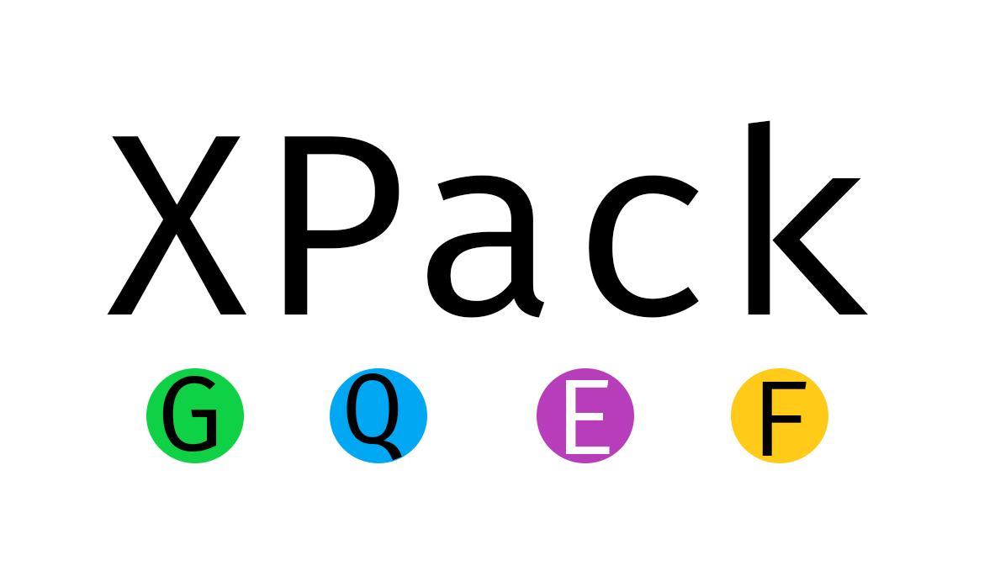
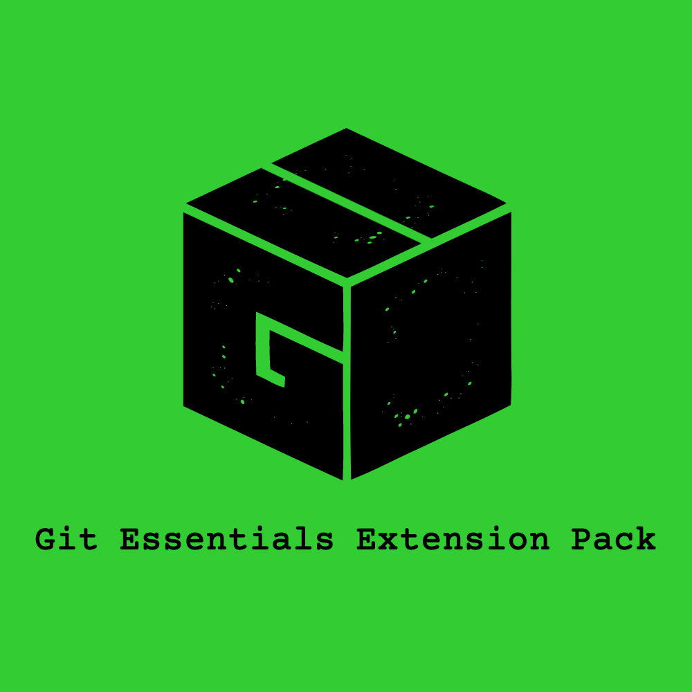
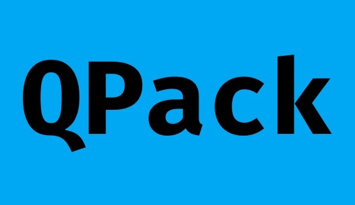
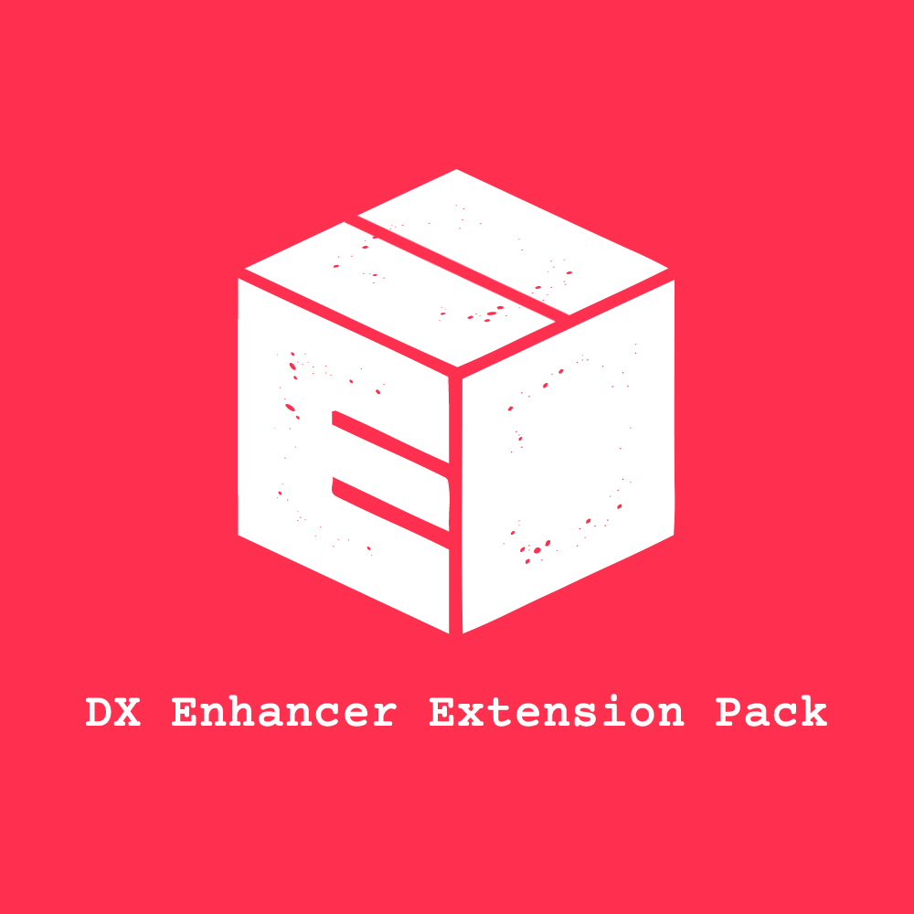
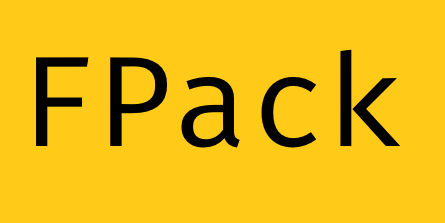

# Web Developer Experience Pack (XPack series)



An Opinionated collection/pack of extensions for Web Developers in VSCode (With Better `DX` and `load time` in Mind)

### 1-Click Setup:

1. Press `ctrl+shift+p`
2. Type `xpack` or `update config`
3. Click on `Update Essentials Web Extension Pack (XPack series) Config` to automatically add below configs to your `settings.json` file

```json
{
  "files.autoSave": "afterDelay",
  "window.zoomLevel": 1,
  "projectManager.openInNewWindowWhenClickingInStatusBar": true,
  "editor.defaultFormatter": "esbenp.prettier-vscode",
  "editor.formatOnSave": true,
  "cSpell.userWords": [],
  "eslint.alwaysShowStatus": true,
  "eslint.codeAction.showDocumentation": {
    "enable": true
  },
  "eslint.lintTask.enable": true,
  "errorLens.statusBarMessageEnabled": true,
  "errorLens.scrollbarHackEnabled": true,
  "errorLens.fontStyleItalic": true,
  "errorLens.statusBarColorsEnabled": true,
  "errorLens.addNumberOfDiagnostics": true,
  "errorLens.addAnnotationTextPrefixes": true,
  "errorLens.gutterIconsEnabled": true,
  "errorLens.followCursor": "closestProblem",
  "workbench.colorTheme": "One Dark Pro",
  "workbench.iconTheme": "material-icon-theme",
  "editor.fontFamily": "Fira Code",
  "editor.fontLigatures": true
}
```

## Extensions Included



- 1- [Git Extension Pack (GPack)](https://marketplace.visualstudio.com/items?itemName=SeyyedKhandon.gpack) - Git Essentials Extension Pack for Visual Studio Code (GPack)



- 2- [Quality/Metric Extension Pack (QPack)](https://marketplace.visualstudio.com/items?itemName=SeyyedKhandon.qpack) - Web Quality/Metric Development Essentials Extension Pack for Visual Studio Code



- 3- [DX Enhancer Pack (EPack)](https://marketplace.visualstudio.com/items?itemName=SeyyedKhandon.epack) - Developer Experience Enhancer/Management Essentials Extension Pack for Visual Studio Code (EPack)



- 4- [Frontend Extension Pack (FPack)](https://marketplace.visualstudio.com/items?itemName=SeyyedKhandon.fpack) - Frontend Development Essentials Extension Pack for Visual Studio Code


- 5- [One Dark++ Extension Pack (TPack)](https://marketplace.visualstudio.com/items?itemName=SeyyedKhandon.tpack) - Theme Essentials Extension Pack(One Dark Pro,Material Icon, FiraCode font) for Visual Studio Code

## Relevant Links

- [Github](https://github.com/SeyyedKhandon/xpack)
- [VS Code Marketplace](https://marketplace.visualstudio.com/items?itemName=SeyyedKhandon.xpack)

**Enjoy!**
